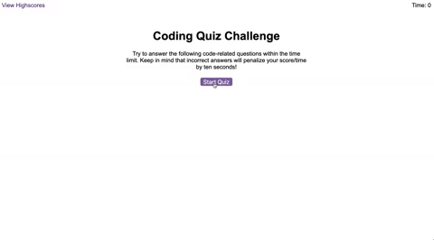

# Code-Quiz
Creating a quiz using JS.
## User Story

```
AS A coding boot camp student
I WANT to take a timed quiz on JavaScript fundamentals that stores high scores
SO THAT I can gauge my progress compared to my peers
```

## Acceptance Criteria

```
GIVEN I am taking a code quiz
WHEN I click the start button
THEN a timer starts and I am presented with a question
WHEN I answer a question
THEN I am presented with another question
WHEN I answer a question incorrectly
THEN time is subtracted from the clock
WHEN all questions are answered or the timer reaches 0
THEN the game is over
WHEN the game is over
THEN I can save my initials and my score
```

## Mock-Up

The following image shows how the web application's appearance and functionality would look like:



## Deployed app
By clicking on the following link, you can access the deployed app: <link>https://17-0602.github.io/Code-Quiz/</link>


By clicking on the following link, you can access the repo on GitHub: <link>https://github.com/17-0602/Code-Quiz</link>